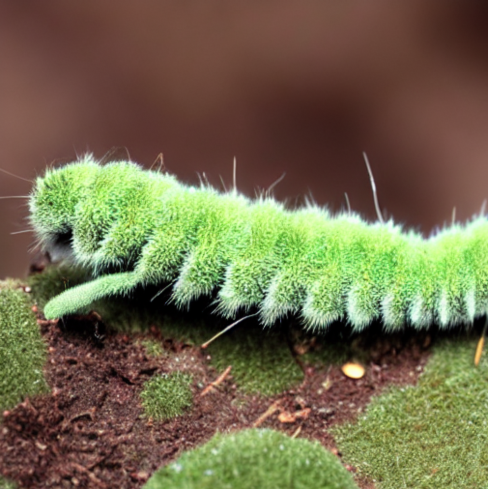
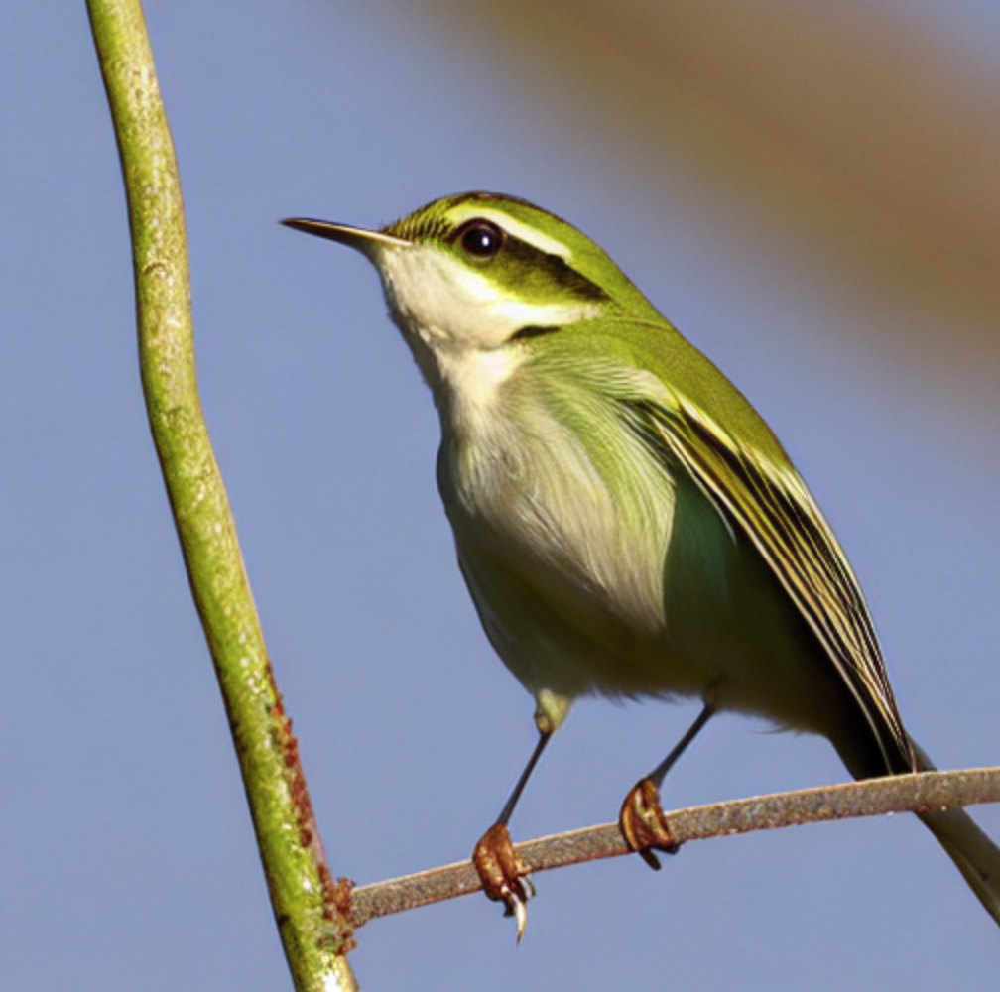
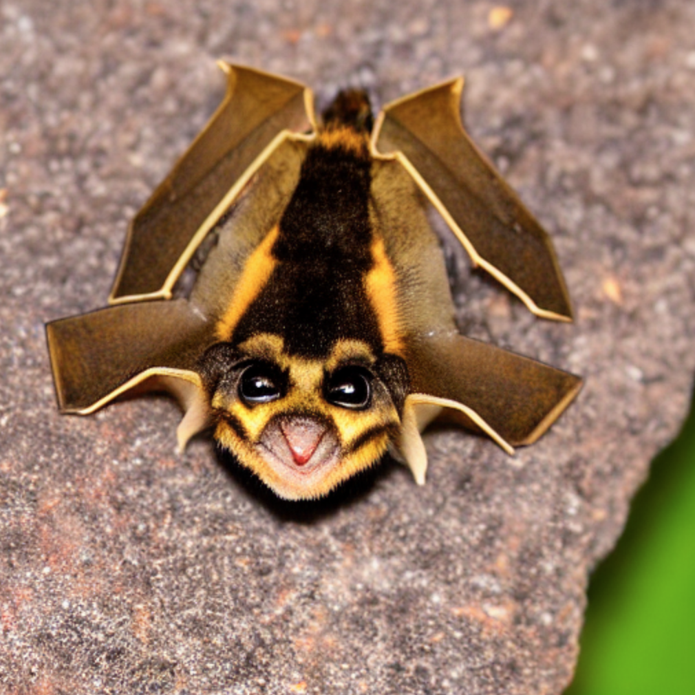
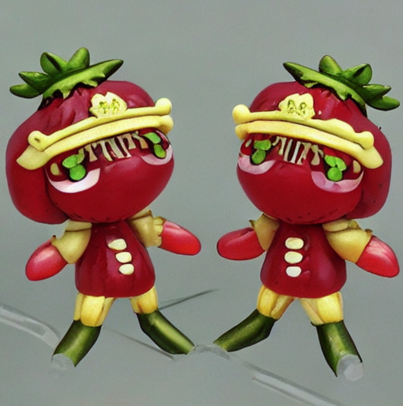
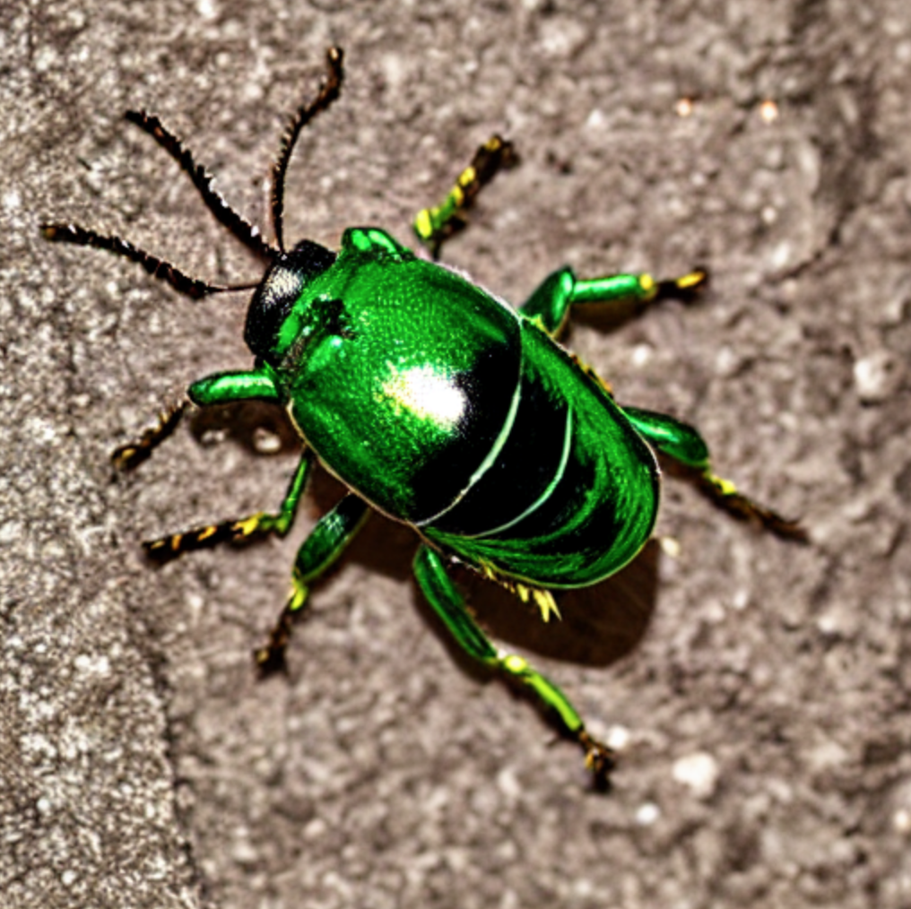
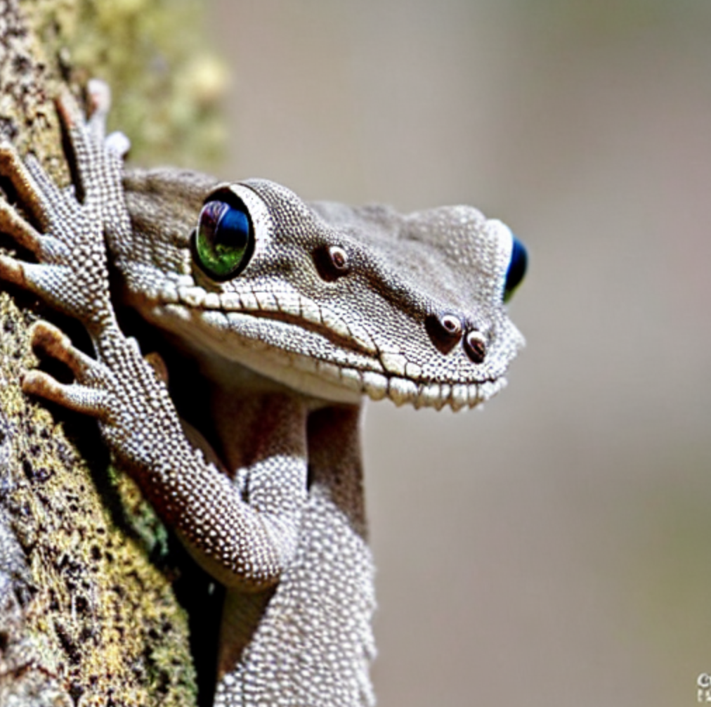

# taxophoney

GPT (Decoder only Transformer - from scratch) generated fake/phoney taxonomies, trained on NCBI taxonomy dataset, included in this repository.

## Requirements

- Pytorch - 1.12.1+cu116 (with CUDA support - for reasonably short training runs)


## Quick training results

```bash
$ python gpt.py
Using device : cuda
step 0: train loss 4.4625, val loss 4.4653
step 500: train loss 2.0843, val loss 2.1280
step 1000: train loss 1.5394, val loss 1.5920
step 1500: train loss 1.3097, val loss 1.3789
step 2000: train loss 1.1842, val loss 1.2741
step 2500: train loss 1.1017, val loss 1.2182
step 3000: train loss 1.0408, val loss 1.1938
step 3500: train loss 0.9831, val loss 1.1692
step 4000: train loss 0.9382, val loss 1.1591
step 4500: train loss 0.8935, val loss 1.1392
step 4999: train loss 0.8545, val loss 1.1383
```

## Generated phoney taxonomy

The model training and sampling script can be used to train the model and generate(sample) a lot of names afterwards. Some of the names have been included in the [taxophoney.txt](taxophoney.txt) file included in the repo.

## Bonus : Generated images out of the phoney names

Naturally, some of these names makes one wonder what they could look like. I've used the [Stable Diffusion v1-5 Model by RunwayML](https://huggingface.co/runwayml/stable-diffusion-v1-5) to generate the images for some of the names. The generation prompt only includes the common name (inside the parens) and not the scientific names, since they didn't help with plausible images.

### Rhodarius leyi (Leyn's land weaker caterpillar)


### Oligops erythrotis (greater-cheeked of leaf-warbler)


### Ablenus amaratha (Golden-banded stone-eyellow bat)


### Chliostega sp. 'Nawatan (strawberry little emperor)


### Columbidium metulum (blotcheye columbing beetle)


### Gobionia rotalorum (round horned fringe-fingered gecko)

